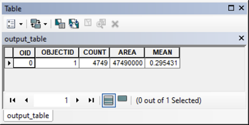

# Lesson 1: Graphical programming with Model Builder

*(c) Vojtěch Barták, FŽP CULS Prague, 2020/2021*

This lesson focuses on deepening skills with automating spatial tasks using the built-in ArcGIS *Model Builder* application. Using a simple graphical chaining of tools and layers, this application provides us with a painless introduction to programming thinking. The lesson is immediately followed by lesson 2, in which you learn to create a user interface for your model. We will not use Model Builder in the next lessons, as we will replace it with a much more powerful tool: the Python programming language.

The lesson assumes knowledge of the basics of GIS and the ArcGIS environment at the level of GIS 1 and GIS 2 subjects, including basic control of the Model Builder application. (If you don't meet any of the above, don't despair, you may find that you attain the necessary knowledge yourself.)

[TOC]

## Basic task

We want to know what is the percentage of forests (or other classes of land cover) in the 300 m zone around the railway tracks. We will perform the analysis:

1. for a fixed district.
2. for all districts.
3. for all districts and all classes of land cover.

We want the output in the form of a table in which each analyzed district will correspond to one row.

## Data

We will use freely downloadable data from the following sources:

- [ArcČR 500](https://www.arcdata.cz/produkty/geograficka-data/arccr-500)
- [Corine Land Cover 2018](https://land.copernicus.eu/pan-european/corine-land-cover/lcc-2012-2018)

From the ArcČR 500 geodatabase we will need the element classes "Zeleznice" (i.e., "Railways") and "Okresy - polygony" (i.e., "Districts - polygons"). They are in the S-JTSK Křovák East-North coordinate system (EPSG: 5514).


The data [Corine Land Cover](https://land.copernicus.eu/pan-european/corine-land-cover/lcc-2012-2018) represent the land cover for the territory of Europe in the ETRS 1989 LAEA coordinate system (EPSG: 3035). This data is distributed in both raster (GeoTiff) and vector (Esri File Geodatabase) form. We will work with the raster.


Before we start the analysis, we need to:

- **Unify coordinate systems** Due to the fact that the transformation of vector data is generally easier and less "lossy" than the transformation of raster data, we transfer layers from ArcCR 500 to the ETRS system (*Project* tool).
- **Clip the raster of land cover to only include the Czech Republic** We can use the *Clip* tool (attention: we mean the tool from the Data Management Tools -> Raster -> Raster Processing, not the tool of the same name from the Analysis Tools -> Extract set) and polygons of districts created by the transformation in the previous step.
- **Reclassify the land cover raster into basic categories**. As is well known, the Corine Land Cover is coded with three-digit codes, the first digit expressing the basic categories, the second digit the more detailed categorization, and the third digit the most detailed one. We will work with the basic categories: 1 - urban areas, 2 - agricultural areas, 3 - forests, 4 - wetlands, and 5 - water bodies. So we need a raster that will only have these five values ​​instead of three-digit codes (*Reclassify* tool).


## A. Solution for a fixed district

Let's say we want to solve the problem for the Jindřichův Hradec district. There are several possible solutions, one of which can be the following:

1. Select the polygon of the Jindřichův Hradec district.
2. Clip the layer of railway tracks with the selected polygon.
3. Create a buffer zone with a radius of 300 m around the tracks.
4. Using zonal map algebra, calculate the (relative) area of ​​forests.

(Step 4 might seem a bit mysterious, we'll discuss it in detail later.)

If we solved the task by running individual tools and not using a model, then we would select the district manually with the *Select Features* tool. When subsequently clipping with the *Clip* tool, it would then be sufficient to use the district layer as the clipping layer, in which a selection would be made. How to solve the selection in the model?

We have two options. The first is to use the *Select* tool (ArcToolbox -> Analysis Tools -> Extract), which applies an SQL query to the layer and creates a new dataset from the selected features.


The second option is to use the *Make Feature Layer* tool (ArcToolbox -> Data Management Tools -> Layers and Table Views). It does not create a new dataset (as was the case with the *Select* tool), but only a layer. (A layer is a temporary representation of a dataset that is not stored on the hard disk, but exists only in the computer's operating memory and is automatically deleted after the model run. It can be used as input to other tools within the model and can contain a selection. One can create any number of layers from a given dataset, each of which can contain a different selection of features.)

As with the *Select* tool, with the *Make Feature Layer* tool, attribute selection can be specified using the *Expression* parameter, into which an SQL query can be written:


Since the second of these options (*Make Feature Layer*) does not require new data to be written to the hard disk, we will naturally prefer it.

Clipping railway tracks with a selected polygon with the *Clip* tool and creating a 300 m buffer zone with the *Buffer* tool are trivial tasks that we will not discuss in detail. However, for the *Buffer* tool, it is worth mentioning the correct setting of the *Dissolve Type* parameter: since we want to perform the analysis for all sections of the railway lines together, it is necessary to set this parameter to the value "ALL". The resulting buffer zones around the individual sections are thus merged into a single (multi)polygon.


If we run the model (we remind you to save it first, not in a folder, but in a toolbox), we should get something like this (we remind you that the results from the model need to be added to ArcMap manually):


> Verify that you have set the *Dissolve Type* parameter in the *Buffer* tool correctly. You should only see one row in the attribute table of the resulting polygon layer.

Now the last step remains, "using zonal map algebra, calculate the relative area of ​​forests". Again, several possible solutions exist. We will show the one that is particularly effective if we want to calculate the *relative* area (i.e., the percentage of the area relative to the total area, here the percentage of the forest area relative to the total area of ​​the buffer zone). It consists of two steps:

1. Create a logical raster (i.e., a raster with values ​​0/1) representing forests (1 ... forest, 0 ... other land cover types).
2. Use the *Zonal Statistics as Table* tool (ArcToolbox -> Spatial Analyst -> Zonal) to calculate the average from the above raster in the buffer zone. (Note that the average of zeros and ones in the buffer zone gives the relative proportion of ones, i.e., the relative area of ​​forests on a scale of 0, 1. We then get the relative area in percentage simply by multiplying by 100.)

The first of these steps can be implemented, for instance, by reclassification (ArcToolbox -> Spatial Analyst -> Reclass -> *Reclassify*) or with the *Equal To* tool (ArcToolbox -> Spatial Analyst -> Math -> Logical). The latter option is simpler, so we will use it. In the land cover raster, forests are represented by a value of 3, so the raster will be compared with the value 3 by the *Equal To* tool:


The resulting model might look like this:


After saving and running the model, we receive the resulting DBF table, which shows that the percentage of forests in the 300 m zone around the railways in the district of Jindřichův Hradec is about 30%:



## B. Solution for all districts

If we want to solve the same task for all districts, there is no need to initially select a district with the *Make Feature Layer* tool and clip railway tracks with it. However, in order to distinguish which parts of the lines belong to which districts, we must calculate the intersection of the two layers with the *Intersect* tool. The resulting layer will contain sections of lines cut by the boundaries of districts, and the attributes of these sections will also contain information to which district which section belongs.

If you then set the *Dissolve Type* parameter to "LIST" in the *Buffer* tool, and choose the field with district names ("NAZ_LAU1") in the list of *Dissolve Fields*, the result will be one (multi)polygon for each district. We then use the layer of these polygons (buffer zones) as *Input Zone Data* in the *Zonal Statistics As Table* tool.

Resulting model:


and the result:


We immediately see that the highest proportion of forests around the tracks is the district of Prachatice, 51%.

## C. Solution with iteration over land cover classes

If we want to perform our analysis for all classes of land cover, we have two options:

- apply solution B in a loop through individual land cover classes,
- modify solution B so that the analysis is performed for all land cover classes at once.

The second solution is undoubtedly more effective (see [task 1](# tasks]) at the end of the lesson), for example, because it is not necessary to repeat the intersecting and buffering in each round of the cycle. However, since our goal is to show the use of an iterator in a model, we turn to the first method here. The advantage is that it only requires a small modification of the model created in solution B.

In order to have a procedure performed repeatedly (i.e., in a loop), it is necessary to insert the so-called *iterator* into the model. Because we want to iterate over values ​​of a discrete raster, we use an iterator passing through values ​​of a given field of an attribute table (Insert -> Iterators -> Field Value).


The picture shows the correct connection of the iterator to the model. The iterator has the following parameters:

- *Input Table*: input table to be passed through in the loop. In our case, it is the attribute table of the Corine Land Cover raster, so we set the value of the parameter to this raster. (You probably did this manually by connecting the raster and the iterator with an arrow.)
- *Field*: the field whose values we want to loop through. In our case, it is the Value field, containing the raster values.
- *Data Type*. The iterator loops through the field line-by-line, and in each iteration, it returns the corresponding value of this field. The *Data Type* parameter controls the data type of the returned value. It depends mainly on what we want to do with that value further in the model. In our case, the output value from the iterator will be used in the *Equal To* tool as a constant against which to compare the Corine Land Cover raster. The corresponding data type will therefore be one of the numerical types, i.e., "Double" or (in case of discrete rasters) "Long".
- *Unique Values​​*. If this box is checked, only unique values ​​of the field are looped through (i.e., no value is repeated). If not checked, the entire table is looped through line by line. Of course, we only want to go through unique values in our case.
- *Skip Null Values​​*. If you know that the field contains some values ​​that should be omitted when looping, check this box and specify these values ​​with the *Null Value* parameter.

If we ran the model in this way, the calculation would probably have been carried out without any problems, but the result would only be a single table corresponding to the last processed land cover class. This is because in each iteration, the calculation ends with the creation of a table with the *Zonal Statistics as Table* tool, which always names the output table in the same way. If we have ArcMap enabled to overwrite existing datasets, then the new table will overwrite the table created in the previous iteration. (If you don't have permission to overwrite existing data, you'll even get an error message.)

How to get out of it? The solution is to use the value returned by the iterator as a part of the output table name. For example, if we select `<base base> _ <land cover code>.dbf` as the output name structure, the output tables can be named `Coverage_1.dbf`, `Coverage_2.dbf`, etc.

A reference to a model variable (variables in the model are all entities represented by ovals) in the name of an output dataset can be created using the `%` character before and after the variable name. The practice will be clear from the example in the following figure, where the name of the variable "Value" (i.e., the variable representing the value returned by the iterator) is incorporated into the name of the output table. The table name is therefore written as `Coverage_%Value%.dbf`, and in each iteration, the `%Value%` part is replaced by the current value of the Value variable.


Now all you have to do is run the model and view the resulting tables.

(If you thought it would be great not to have the output in five different tables, but to only create one table with individual land cover classes in columns, look at the Tasks 1 and 2 at the end of the lesson. Task 1 should make you satisfied. Task 2, on the other hand, can prove quite difficult, but don't worry if you can't accomplish it: once you learn to write scripts in Python instead of building models, everything will be much easier!)

## Exporting a model to Python

The created model can be easily exported to a Python script:


This saves a file with a .py extension. It is an ordinary text file which, when opened in a notepad, looks like this:

```
# -*- coding: utf-8 -*-
# ---------------------------------------------------------------------------
# exported_model.py
# Created on: 2020-09-18 16:35:39.00000
#   (generated by ArcGIS/ModelBuilder)
# Description: 
# ---------------------------------------------------------------------------

# Import arcpy module
import arcpy

# Load required toolboxes
arcpy.ImportToolbox("Model Functions")


# Local variables:
districts = "okresy"
railways = "zeleznice"
districts_railways_Intersect = "C:\\Users\\vojta\\Documents\\ArcGIS\\Default.gdb\\districts_Intersect"
buffers = "C:\\Users\\vojta\\Documents\\ArcGIS\\Default.gdb\\districts_Intersect_Buffer"
CLC_2018_tif = "CLC_2018.tif"
Value = CLC_2018_tif
Forests__0_1_ = "C:\\Users\\vojta\\Documents\\ArcGIS\\Default.gdb\\EqualTo_tif1"
coverage__Value__dbf = "C:\\my_path\\Coverage_%Value%.dbf"

# Process: Intersect
arcpy.Intersect_analysis("districts #;railways #", districts_railways_Intersect, "ALL", "", "INPUT")

# Process: Buffer
arcpy.Buffer_analysis(districts_railways_Intersect, buffers, "300 Meters", "RIGHT", "ROUND", "LIST", "NAZ_LAU1", "PLANAR")

# Process: Iterate Field Values
arcpy.IterateFieldValues_mb(CLC_2018_tif, "Value", "Double", "true", "false", "0")

# Process: Equal To
arcpy.gp.EqualTo_sa(CLC_2018_tif, Value, Forests__0_1_)

# Process: Zonal Statistics as Table
arcpy.gp.ZonalStatisticsAsTable_sa(buffers, "NAZ_LAU1", Forests__0_1_, coverage__Value__dbf, "NODATA", "MEAN")
```

It is not the purpose here to explain everything that is written in the script. This is just a brief example of what you will learn to write yourself in this course. So with gusto!

## Summary

In this lesson you have **repeated**:

- several vector (Clip, Buffer, Intersect) and several raster (Equal To, Zonal Statistics as Table) analysis tools,

- how to use Model Builder to chain tools in a workflow when designing a solution of a complex problem.

Newly **learned**:

- how to select features in the model without having to write the selected features to a new dataset on disk (Make Feature Layer tool),
- how to use an iterator in the model (with iterating over field values),
- how to export a model to a Python script.

## Exercises

1. Modify the solution C to avoid use of an iterator. (Hint: You may want to use the *Tabulate Area* tool.)
2. Modify the solution C so that the output is only one table, whose columns would correspond to the individual land cover classes. However, leave the iterator in the model. (Hint: explore the tools in the toolsets Fields and Joins of the Data Management Tools toolbox.)
3. Modify solutions A, B or C (or all) to use *vector* Corine Land Cover data (download [here](https://land.copernicus.eu/pan-european/corine- land-cover / lcc-2012-2018)). (Hint: You may want to use the *Tabulate Intersection* tool.)