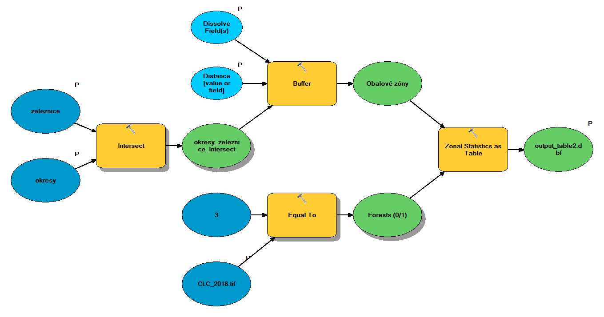
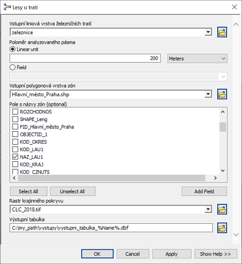

# Lesson 2: User interface for tools from Model Builder

*(c) Vojtěch Barták, FŽP CULS Prague, 2020/2021*

In this lesson, we will build on lesson 1 and create a user interface to the model. The model becomes a tool similar to the built-in ArcGIS tools. When running the tool repeatedly, the input and output layers can be changed, as well as the values ​​of other parameters we have defined. In addition, the tool with a defined interface can be used in other models as well as in Python scripts.

[TOC]

## Starting model

The starting model for this lesson will be the model created in Lesson 1 under Solution B. This model calculates the relative representation of forests in a 300 m wide strip around railways.

So far, we have been used to working with the model in edit mode (right-click on the model in the Catalog and select *Edit*) and running it using Model -> Run Entire Model. However, the model has a pre-built user interface, similar to the built-in tools in ArcToolbox. We open the window of our model-tool by double-clicking on the model in the Catalog (or right-clicking on the model and selecting *Open*).

So far, the tool window does not offer much: as the message in the middle says, it does not have any parameters defined by which the user could control the calculation run. After clicking on OK, the model will start with the settings as we defined them when editing the model (do not hesitate to try it).

Now let's set the parameters for the model so that the user interface makes a little more sense.

## Defining tool parameters

Defining parameter can be done when editing the model (once again: right-click on the model in the Catalog and select *Edit*). A parameter is anything we want the user to set before running the tool. So at least it should be input and output data.

A given model item becomes a parameter when we right-click on it and check the Model Parameter option.

The letter "P" then appears next to the item in its upper right corner to indicate that it is a model parameter.

If we set all input layers (railways, districts and raster CLC_2018.tif) and output table (output_table.dbf) as parameters in this way, save the model and then open the tool window, it will now look like this:

Before running the tool, the user now has the option to change the input layers and decide how to name and where to save the output table.

What other parameters might the user want to change? For example, he/she could determine the width of the strip around railways in which the analysis is to be performed. Now the buffer radius is fixed at 300 m, but it is quite conceivable that it will be desirable for some application to change this value.

In the model, the item with the value of 300 does not appear directly, this value is "hidden" in the Buffer tool settings. So how to make a parameter out of it? We have two options:

1. We can add a new variable of numeric type (Double) to the model and connect it with the Buffer tool, i.e., make it an entry into this tool:

   

   We then make a parameter from the new variable in the standard procedure (right-click on it and *Model Parameter*).

2. We can make the parameter *Distance [value or field]* of the Buffer tool directly the parameter of the model. Just right-click on the Buffer tool and select *Make Variable -> From Parameter -> Distance [value or field]*. We then set the resulting variable as a parameter.

   

There is one small difference in these two options: while in the first case the resulting variable (and thus the corresponding parameter) is of type *Double*, in the second case this variable is of type *Distance [value or field]*. Instead of a fixed buffer radius, the user can alternatively specify a field in the input layer attribute table in which an individual buffer radius for each feature is specified. For example, we could set a different width of the buffer zone for each district or category of line. The proper choice between such alternatives depends on what you want your tool to offer the user.

Should there be any more parameter in the model? You can create an almost infinite number of parameters, but we always want to keep the user interface well-arranged and clear and not containing unimportant items. One more parameter is worth considering in our tool: when creating the model, it was important to set *Dissolve Type* and *Dissolve Fields* correctly in the Buffer tool so that the resulting table contains summary values ​​for individual districts. However, the field with the district names does not have to be named the same every time the user runs the tool. After all, the user can perform the analysis for other territorial units than for districts (e.g., regions or states). Therefore, it will be a good idea to set the *Dissolve Fields* parameter of the Buffer tool as a model parameter, in the same way we did with the *Distance [value or field]* parameter.

The resulting model should look like this (note the parameter designation with the letter "P"):

The tool window now looks like this (attention: the model needs to be saved):

## Parameter names, order, and default values

The user interface, as we set it up, allows the user to change parameter values, but it doesn't look very nice. If the user is not well acquainted with what the tool should do and what parameters are important, he/she will probably not be very wise from our user interface. To improve this, we need to:

- give reasonable names to the parameters,
- adjust the order of the parameters accordingly,
- set reasonable default values ​​for the parameters,
- document the behavior of the tool using help.

In this section we will discuss how to get the first three steps, in the next section we will focus on help.

Parameter names are given by the names of the corresponding variables in the model. The name of a variable (i.e., of an oval in the graphical diagram of the model) is first automatically generated (e.g., the variable representing the input data that we dragged into the model with the mouse is named the same as the corresponding layer in Table of Contents), but it can be changed. Just right-click on the variable and select *Rename*.

When we rename all the parameters of the model in this way, our user interface gets a little clearer:

The next step is to adjust the order of the parameters. The current order is largely a coincidence: the parameters are in the order in which we created them when editing the model. It is possible to change the order of parameters in the model properties, which are available either by right-clicking on the model in the Catalog -> *Properties*, or from editing the model via *Model -> Model Properties*. On the properties tab, go to the *Parameters* tab, where you can adjust the order of the parameters using arrows.

After a reasonable adjustment of the order of the parameters, the tool could look something like this:

Another thing that can be changed is the default parameter values. These are the values ​​that are automatically pre-filled in the fields for individual parameters. The default values ​​are given by how we created the model. You can change them simply by double-clicking on the individual items of the model (during editing) and changing the value.

For tools that we want to run repeatedly with a certain given parameter setting, it is advisable to set these values ​​as default. However, if we want the tool to be used universally, by different users and in different contexts, it might be reasonable not to set any specific default values. This is simply achieved by deleting the values ​​for individual variables-parameters (the small price is that the model will not be colored - i.e., ready to run - in the editing mode).

Now the user will be forced to specify the values ​​of all parameters at his own discretion.

Our tool now looks much more general than at the beginning. For example, try to run it not for districts, but for regions ("kraje" in Czech), with the width of the analyzed band 500 m, or with different widths for different categories of lines. (You can get the layer of regions, for example, from the database [ArcData 500](https://www.arcdata.cz/produkty/geograficka-data/arccr-500), but you must project it to the ETRS 1989 LAEA coordinate system, or you can already download the transformed dataset [here]()).

## Help

First we change the name of the tool: on the *General* tab of the model properties we fill in the fields *Name* (actual tool name used, e.g., when calling the tool in Python) and *Label* (name under which the tool is displayed in the toolbox).

Help for the tool can be created in HTML format using a form, which we open by right-clicking on the tool in the Catalog and selecting *Item Description*. In it, after clicking on *Edit*, we simply fill in the items that we want to document.

We can open the finished help (eg in a web browser) by right-clicking on the model in the Catalog and selecting *Help*.

The help of individual items is also displayed directly in the tool window by clicking on the *Show Help* button:

## Nesting a model in another model

If a model has a defined user interface in the form of adjustable parameters for inputs and outputs, it can be used in a similar way as any other tool in ArcToolbox:

1. it can be launched using the tool window,
2. it can be inserted into other models,
3. it can be called in Python.

We already know the first option. We will now show the second option, nesting the model in another model. The third option will be the topic of further lessons.

We will show the nesting of the model into another model on the example when we want to use our new tool in a loop, eg repeatedly for all data sets from a folder. We will solve the situation when we do not have individual districts in one layer, but in separate shapefiles for individual regions stored in a common folder. Instead of inserting the iterator directly into the already created tool, which would require its considerable modification, including modification of the user interface (see [task 2](# Tasks) at the end of the exercise), we create a new model (tool) into which we insert the iterator and connect it to our already created tool.

We must first create the described initial situation: therefore, we must divide the districts into separate shapefiles for individual regions. The *Split By Attributes* tool from the *Analysis Tools -> Extract* toolset is best suited for this. In the tool, you must specify a field that will be used to divide the elements into individual new datasets. The values ​​of this field are also used to name them. In our case, it will be a field with the names of regions, which is *NAZ_CZNUTS*.

> You may have noticed a different *Split By Attributes* tool icon in ArcToolbox. This tool is created in Python. The same icons will appear for the tools you will create later in this course.

In the specified folder (parameter *Target Workspace*) we can find individual shapefiles of districts in regions, named after the region.

Now we will create a new model in Model Builder and insert our tool and iterator (iterating over feature classes) into it(*Insert -> Iterator -> Feature Classes*).

Now the point is to connect the two components appropriately. Double-click on the iterator to get to its parameters and set the folder whose contents are to be looped through (parameter *Workspace or Feature Dataset*).

Other parameters are optional and do not need to be set. For sake of clarity, however, we will explain their meaning:

- *Wildcard* - this is a filter with which we can browse only feature classes whose name has a certain specified structure (eg contains a certain string, starts with a certain letter, etc.).
- *Feature Type* - again a filter, which can be used to set the type of feature classes to be browsed. E.g. you can restrict browsing to polygons only. In our case, we have nothing in the folder other than polygon shapefiles, so we do not need this filter.
- *Recursive* - indicates wheather contents of subfolders of the folder should be browsed as well.

The iterator has two outputs: the feature class that is processed in the given iteration (in our case, the shapefile of the corresponding region) and the name of this feature class (the name of the region). We will use only the first output, ie the shapefile itself, as in each iteration, it will be the input to our previously created tool. Therefore, we connect this output of the iterator with the tool and set it as the value of the parameter *Input polygon layer of zones*.

> This connection is made possible by the fact that in our previous tool, we have defined a user interface.

To run the tool, we must set the remaining parameters of our nested tool. We now have two options: either set the parameters directly in the model editing mode, or make them parameters of this new tool again, thus defining its user interface (instead of the input layer of districts, there will be a parameter specifying the input folder with regions). For simplicity, we choose the first option.

> Attention! Do not forget the parameters that are hidden at first sight, such as defining the radius of the analyzed strip or the field with zone names. You can access them as you would in any other tool: by double-clicking the tool in the model.

Since the output will not be one single table, but as many tables as there are regions, it is necessary to ensure that each is named differently, preferably using the name of the region. We have already solved a similar situation in the last lesson. Recall that in each iteration, the name of the region is an output of the iterator in the form of the variable *Name*. We can then refer to this variable when defining the name of the output table using the `%` character, so the name can look like `output_table_%Name%.dbf`.

The resulting model looks like this:

Now all you have to do is save the model, run it with *Model -> Run Entire Model* and verify that the outputs match your expectations.

> You may think that after all it would be easier to simply add another iterator to the original tool, instead of inserting the whole tool into another model. Here, however, you would encounter one of the basic limitations of Model Builder: it does not support multiple iterators in one model. Therefore, if you want to iterate over several hierarchically nested loops, nesting a model in another model is the only solution. However, as you will see, if you create the same tool in Python, you would not encounter any similar restrictions.

## Summary

In this lesson, you have learned:

- How to create a user interface for a tool from Model Builder by defining its parameters.
- How to set other parameter properties so that the user interface looks good and makes it easier for the user to use.
- How to create help for the tool, both in the form of a separate html page and in the form of a quick help in the tool window.
- How a tool with a created user interface can not only be run through its interface, but also used in another model.
- How to use an iterator over feature classes and how to solve the use of multiple nested iterators in the model.

## Tasks

1. Create a user interface for the basic task from lesson 1, Solution A.
2. Create a user interface for the basic task from lesson 1, Solution C.
3. Create user interfaces for the tasks from lesson 1.
4. Create a user interface for the last model created in this lesson.