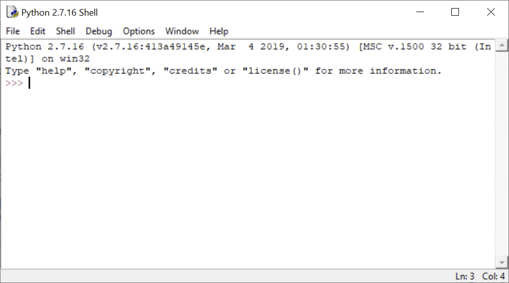

# Lesson 3: How to write and run a program in Python?

## Why Python?

The Python language was developed by the Dutch developer Guido van Rossum in the late 1980s, the first version was published in 1991. The motivation was to develop a really simple, effective, but also fun language. The last aspect is also reflected in the name of the language itself, which is reminiscent of the well-known British comic group Monty Python.

There are several reasons why Python is the right choice for advanced work with geodata and geographic information systems:

- First of all, the Python programming language is very **simple** and can be easily mastered even by a complete beginner without any programming experience.
- Second, Python is a **powerful and advanced object-oriented language**, designed for writing short scripts, but also easy to use for creating large programs.
- Third, Python is **operating system independent**, ie it works as well on Windows as on Linux and other operating systems.
- Fourth, Python is very **popular**, thanks to which there is extensive documentation, tutorials, Internet forums, and most importantly **a large number of libraries** (or in the Python jargon of "modules" and "packages") for computational tasks from various fields.
- Fifth, Python is a so-called **open source** program, which means, among other things, that it is free.
- Sixth, there are **a large number of freely accessible Python modules for working with spatial data**, from vector and raster analysis to the creation of maps and their publication on the Internet. Thanks to this, you can use Python to "build" your own GIS, for free (for more information, see eg Erik Westry's book Python Geospatial Development).
- Seventh, Python is supported as a **scripting language in the ArcGIS programming environment**. Starting with ArcGIS Desktop 10, it is even the exclusive scripting language (earlier versions allowed the use of other scripting languages, but all documentation and examples were written in Python anyway). This fact is especially important in this course, as it focuses on using ArcGIS functionality via Python.

## Python Installation and Versions

Python currently exists in version 3.9. However, ArcGIS has long hesitated to integrate Python 3.x series, as relatively major changes have been made to Python between series 2.x and 3.x. Therefore, all versions of ArcGIS Desktop still work with Python version 2.x, with ArcGIS 10.x it is Python version 2.7. The transition to the current version of Python in Esri products did not take place until the arrival of the new ArcGIS Pro product, which replaces the older ArcGIS Desktop with its familiar ArcMap application. Since we will be working with ArcGIS Desktop in this course, we will be based on the now outdated version of Python 2.7. This should not cause major problems, as there is no substantial difference in both versions of the language for beginners. Where there is a difference, we will point it out at the appropriate time. In addition, it is not a problem to have multiple versions of Python installed on your computer, you just need to pay attention to which version you are currently working with.

If you have ArcGIS software installed on your computer, you most likely have the appropriate version of Python installed, as it is distributed and installed automatically with ArcGIS. You can easily find it in the list of Windows applications, where Python is either in a separate folder or inside the ArcGIS folder. If you have ArcGIS installed, but you still can't find Python, it's possible that you (apparently unintentionally) rejected its installation when you were installing ArcGIS. In this case, the easiest solution will probably be to install ArcGIS again. The point is that when installing ArcGIS, not only Python itself is installed, but also the ArcPy key library (package), which mediates the functionality of ArcGIS into Python.

Of course, you can also install Python manually, for instance, if you want newer versions of Python. In this case, we recommend using the installation via the Anaconda or Miniconda distribution platform.

## IDLE and Python Shell

Programs written in Python can be run in various ways. The simplest form of the program is a simple text file with the source code, usually saved with the suffix `.py`. It can be run:

- from the **operating system command line**, simply by typing the address of the source code file. At the same time, you can run the interactive Python code compiler directly on the command line, which puts the command line in Python mode and allows you to write and run individual Python commands directly in it.
- from the **Python command line**, which is available after installing Python as a standalone application. It is ideal for typing and running individual commands.
- from the interactive graphical interface **IDLE**. Here it is possible to run single commands on the console (command line), but at the same time edit and run source code files. We will use this option in this course. IDLE is also a standard part of the basic Python installation.
- from a more advanced **Integrated Development Environment** (IDE). It is a program that allows easy editing of source code and its interactive translation, ie "execution". At the same time, various IDEs offer, for example, management of graphical outputs, variables and objects overview, creation of annotated interactive code, integration of other programming languages, etc. **Jupyter Notebooks** is one of the recommendable environments, allowing one to combine directly executable blocks of code followed by outputs of a given calculation (eg a chart), with extensive comments in the Markdown language. Another free and well devoleped IDE is **Spyder**, which is especially suited for data analysis, and which in some ways resembles the well-known development environment for the R statistical language RStudio.

A specific option when using Python to work with ArcGIS is a dedicated Python command line directly integrated into ArcMap, resp. ArcGIS Pro. You will also try this option in this course. In the following text, we will introduce the IDLE development environment, which we will use across the course.

**IDLE** is used for interactive interpretation of code written in Python. This means that it is possible to run any part of the code in it and the commands are executed immediately. There are a number of other interpreters or development environments for Python (see above), however, since IDLE comes with Python as part of a standard ArcGIS installation, we will focus on it. It is also advantageous because working in it is very easy. On the other hand, a certain disadvantage of this environment is the limited possibilities of code debugging (ie finding errors in code).

> IDLE was also created by Guido van Rossum, and like Python itself, it is free and freely redistributable. The name is an abbreviation for Integrated DeveLopment Environment. It is worth noting that since the commonly integrated development environment is abbreviated IDE, the added "l" probably refers to one of the members of the Monty Python group, Eric Idle.

The IDLE environment can be started from the Windows program menu. When you start IDLE, an interactive window called Python Shell opens.



> **Task 1.** Open the IDLE program.

The Python Shell window is used to execute individual commands and run scripts. The symbol `>>>` is the so-called *command line prompt*, after which you can write a command. After pressing `Enter`, the command is sent to the *compiler* and the result is written to the next line:

```python
>>> 1 + 2
3
>>> "Hello world!"
'Hello world!'
```

As can be seen from the above example, after writing a simple (or even more complex) mathematical expression, this expression is evaluated and the result is returned. In this way, the Python Shell window can actually be used as a simple calculator:

```python
>>> -(2 + 3) * 5
-25
```

To store a value for future use, you can create a so-called *variable* and store the value in it:

```python
>>> x = 2
>>> my_number = 3
>>> -(x + my_number) * 5
-25
```

Values stored in variables can be of other data types than numeric, eg a text:

```python
>>> a = "Hello world!"
>>> a
'Hello world!'
```

The Python Shell window offers a number of options to make writing commands easier. We will discuss only some, other options can be found in the main menu under *Edit*:

- **Commands history**. After pressing the keyboard shortcut `Alt` +`P` ("P" as "previous") we call the last executed command, when pressing this shortcut repeatedly we go back through the history of commands. Similarly, by pressing the keyboard shortcut `Alt` + `N` ("N" as "next") we can scroll forward in the history of commands. Another way to recall the previous command is to place the cursor on it and press enter. The command is then automatically pasted after the command line prompt, and can be executed by pressing enter again.
- **Translation abortion**. To interrupt the current execution of the command, press `Ctrl` +`C`. (Useful if the calculation takes too long for some reason.)
- **Whispering**. After typing any sequence of characters and pressing the keyboard shortcut `Ctrl` + `Space`, a list of all available functions, variables and language keywords starting with the given letters will open. You can select from them using the up and down arrows.

> **Task 2.** In the Python Shell window, create several variables and try simple arithmetic operations. Try browsing the command history.

## Writing and running scripts

A script is a separate text file with code that can be run as a whole. The script can be written in any text editor, but it must be saved with the suffix `.py` so that the compiler (eg Python Shell) recognizes that it is a Python code.

In IDLE, it is possible to write scripts in a dedicated text editor that offers some advantages over conventional text editors - for example, the code is colored so that one can better understand it and navigate through it. At the same time, the script written in IDLE editor can be immediately sent to the compiler and run.

> **Task 3.** Open a new script in IDLE using *File -> New File*, or `Ctrl` + `N`. In the script, type the commands `a = "Hello"`, `b = "World"` and `print(a + " " + b)` in separate lines. Save the script and run it with the `F5` key, or with *Run -> Run Module*.

The IDLE program can also be opened from a saved script.

> **Task 4.** Close the IDLE program. In the file browser, locate the created script, right-click on it and select *Edit with IDLE*.

## Python console in ArcMap

Python is integrated into ArcMap in several ways. One of them is an interactive Python console, a compiler somewhat similar to Python Shell. In this window we can call (almost) any Python commands, but at the same time (as we will see later) it allows us to use in the commands layers currently loaded in the Table Of Contents. Also, output geodata from analyzes performed in the Python console are automatically inserted as layers into the Table Of Contents.

> **Task 5.** In ArcMap, open the Python console and try to run simple commands that you ran previously in the Python Shell window.

## Summary

In this lesson, you learned about the IDLE environment, tried to write and run simple commands in the Python Shell window, and write and run a simple script. You also got known the Python console in ArcMap.

## Exercises