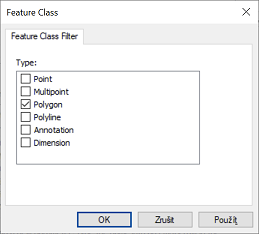
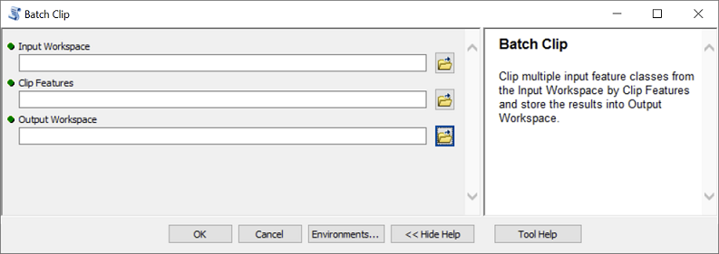

# Lesson 12: Tool User Interfaces

In this chapter, we'll create a user interface for a script that uses ArcGIS tools. As a result, our tool will look and behave similar to other built-in tools in ArcToolbox. You already know from Lesson 2 how to create user interfaces to models from Model Builder. This is analogical.

## Simple interface

We'll create a tool with a simple example of the *BatchClip* tool you created in Lesson 10 (see Task X). The relevant script can look like this:

```python
import arcpy, os.path

# Input parameters
input_folder = r"C:\path\to\folder\with\input\data"
clip_features = r"C:\path\to\clip\polygon\dataset.shp"
output_folder = r"C:\path\to\folder\with\clipped\datasets"

# Environment settings
arcpy.env.workspace = input_folder
arcpy.env.overwriteOutput = True

# Batch processing with the Clip tool
shps = arcpy.ListFeatureClasses()
for shp in shps:
    output = os.path.join(output_folder, shp[:-4] + "_clipped.shp")
    arcpy.Clip_analysis(shp, clip_features, output)
```

> **Task 1.** Read the script so that you have understand clearly the meaning of each line. Test in practice that the script works.

Creating a user interface for the script means ensuring that the input parameters (deliberately listed at the beginning of the script in a separate section `Input parameters`) can be entered by the user in some friendly graphical interface before running. Its creation has two parts: (1) preparation of the graphical interface itself and (2) modification of the script so that it communicates with this interface.

The creation of the graphical interface begins in the *Catalog* window of the *ArcMap* program. The tool - as in the case of Model Builder - must exist in some toolbox. So if you don't have one ready, you need to create it now:


(Of course, we can have multiple tools stored in one toolbox.)

After creating the toolbox, we will add a new tool to it by right-clicking on it and selecting *Add -> Script*:


This will open the *Add Script* dialog box, which will guide you through creating a graphical interface. On the first page, enter the name (*Name*) and label (*Label*) of the tool. While the name should not contain any special characters and spaces, the label will be how the tool will appear in the toolbox (so it can contain spaces and special characters). In the parameter *Description* it is possible to enter a brief description of the tool operation, which will be displayed in the tool window. The *Stylesheet* parameter allows you to select a non-default interface style, including custom user-defined styles. We will not deal with custom styles here, we will use the default style (ie leave the field blank). The last two parameters, the *Store relative pathnames* and *Always run in foreground*, are good to check both. The first will cause the path to the script (which we will enter in the next step) to be taken relative to the position of the toolbox. This will facilitate any possible distribution of the tool to other computers. The second option ensures that the tool always runs in the foreground (not in the background), which is generally a safer and more stable option.


After clicking on *Next*, the path to the script itself is entered in the next window. It is a good practice to have the script stored in the same folder in which we have the toolbox.


The following page enters the tool parameters. At the top is a table with parameters, at the bottom are the properties of the selected parameter. Start typing the parameter name in the left column of the table. Then select its type in the right column. The first parameter will be "Input Workspace", ie the folder with input layers. The type of this parameter can be either *Folder* or *Workspace*. If we choose the first option, the tool will be able to work only in the classic folder with shapefiles. The second option, *Workspace*, is more general and includes a file geodatabase and other types of ArcGIS workspaces in addition to classic folders, so the tool will be able to trim all vector layers in a geodatabase or its dataset (*Feature Dataset*). It is therefore more advantageous to choose this second option. For this parameter, all the default values ​​of the properties (at the bottom of the window) are satisfactory (go through them and try to judge what the meaning of each property is).


Another parameter will be the clipping dataset or layer ("Clip Features"). Its type could be *Shapefile*, *Feature Class* or *Feature Layer*. The second option is again more general than the first and allows you to work not only with shapefiles, but also with layers in a geodatabase. However, the third option is the best, because in addition to the above options, it also allows you to work with layers in ArcMap. Therefore, if we select it (and we do select it), the tool will automatically offer a list of currently loaded layers from the map document to the appropriate parameter.

It is also advisable to set the so-called *Filter* for the parameter *Clip Features*, which will not allow the user to enter a geometric type other than polygon. The appropriate setting is made in the parameter properties, property *Filter*.


Clicking on *Feature Class* opens a window with check boxes where you only need to leave the "Polygon" option checked:



The last parameter will be *Output Workspace*, ie the folder (or geodatabase) where the output datasets will be stored. Again, this will be a *Workspace* type with default property settings. Now we have the parameters set and we can click on *Finish*. After opening the tool from *Catalog*, we see a ready-to-use user interface:



It remains to arrange that the parameter values ​​entered by the user in the graphical interface are passed to the script. The `GetParameterAsText` function from the `arcpy` package is used for this. When you run the tool, this function reads the value from the user interface and returns it as a text string. (*Note: In our case, all parameters are text - see the script at the beginning of the lesson - so passing them in the form of text is what we need. However, if we want to enter numbers or other data types in some parameters, the parameter value received from the* `GetParamaterAsText` *function must be then converted to the appropriate data type.*)

The only argument to the `GetParameterAsText` function is the index or order of the parameter to be read. The order of the parameters corresponds to how we arranged them in the graphical interface. Therefore, the header of our script will now look like this:

```python
import arcpy, os.path

# Input parameters
input_folder = arcpy.GetParameterAsText(0)
clip_features = arcpy.GetParameterAsText(1)
output_folder = arcpy.GetParameterAsText(2)

# Environment settings
arcpy.env.workspace = input_folder
arcpy.env.overwriteOutput = True

# Batch processing with the Clip tool
shps = arcpy.ListFeatureClasses()
for shp in shps:
    output = os.path.join(output_folder, shp[:-4] + "_clipped.shp")
    arcpy.Clip_analysis(shp, clip_features, output)
```

Now the tool is ready and we can run it.

> **Task 2.** Create an interface to *BatchClip* as described and test the tool.

## Messages

Sometimes it is useful if we have messages embedded in the script that are output at a certain stage of the calculation (eg on the Python Shell console). This is especially advantageous in two cases:

- If the calculation is long and includes a number of steps, or a cycle, it is possible to report at the beginning of each step or iteration of the cycle what the program is doing. So we will have an overview of what stage of the calculation we are at. In addition, if the program fails at some stage and ends with an error message, we will know at what stage of the calculation it was and where to look for an error in the code.
- The second situation is if our program does not work properly and we do not know where the error is. If, for example, we suspect that at a certain stage a variable does not contain the value it should have, we can have the content of this variable reported at the given moment of the calculation. This can be very helpful in finding where we made a mistake.

In the case of our simple tool *BatchClip*, for example, we might want information about the layer the program is currently processing to be output in each round of the cycle. To print to standard output (eg the Python Shell console), simply use the `print` function:

```python
import arcpy, os.path, sys

# Input parameters
input_folder = r"C:\path\to\folder\with\input\data"
clip_features = r"C:\path\to\clip\polygon\dataset.shp"
output_folder = r"C:\path\to\folder\with\clipped\datasets"

# Environment settings
arcpy.env.workspace = input_folder
arcpy.env.overwriteOutput = True

# Batch processing with the Clip tool
shps = arcpy.ListFeatureClasses()
for shp in shps:
    
    print ("Working on " + shp + "...")
    sys.__stdout__.flush()
    
    output = os.path.join(output_folder, shp [:-4] + "_clipped.shp")
    arcpy.Clip_analysis(shp, clip_features, output)
```

The strange line `sys.__stdout__.flush()` ensures that the print is done really immediately. If we don't include this line, often nothing bad will happen and the code will work as it should. Sometimes, however, prints are delayed, so all calculations are performed first, and then all messages are written to the console at once. As a result, interim reports are no longer ongoing and lose their meaning. The `__stdout__` object from the `sys` module (note that this module had to be loaded at the beginning of the script!) represents the so-called *standard output*, which in our case is the Python Shell console. Its `flush` method then "spills" or "flushes" all processes that are currently waiting in the process queue.

How can similar messages be sent to the tool calculation window in ArcMap? The classic `print` no longer works here, however, the `AddMessage` function of the `arcpy` package will do a similar job. So we modify the tool script as follows:

```python
import arcpy, os.path

# Input parameters
input_folder = arcpy.GetParameterAsText(0)
clip_features = arcpy.GetParameterAsText(1)
output_folder = arcpy.GetParameterAsText(2)

# Environment settings
arcpy.env.workspace = input_folder
arcpy.env.overwriteOutput = True

# Batch processing with the Clip tool
shps = arcpy.ListFeatureClasses()
for shp in shps:

    arcpy.AddMessage("Working on " + shp + "...")

    output = os.path.join(output_folder, shp[:-4] + "_clipped.shp")
    arcpy.Clip_analysis(shp, clip_features, output)
```

The interim statement in the calculation now looks like this:


> **Task 3.** Add the runtime messages to *BatchClip* as described above and test.

## Multiple and output parameters

There are a large number of different types of parameters and their properties. We will show some of them on the example of another tool, which is to make a common single buffer zone with a specified radius for multiple input datasets, possibly of different geometry types. In other words, individual buffer zones around the input layers should be combined into a single layer. Further, the spatially non-overlapping parts should be in separate polygons, while the spatially overlapping parts of the buffer zone should be combined into a single polygon.

If we had a point, line and polygon layer at the input as in this picture:


the output layer should look something like this:


The script that handles this task might look something like this:

```python
import arcpy

# Input parameters
feature_list = [r"C:\...\dataset1.shp", r"C:\...\dataset2.shp", ...]
buffer_distance = 100
output_features = r"C:\...\output_dataset.shp"

# Environments settings
arcpy.env.workspace = "in_memory"
arcpy.env.overwriteOutput = True

# Buffer zones
buffers = []
for fc in feature_list:
    b = arcpy.Buffer_analysis(fc, fc + "_buffer", buffer_distance)
    buffers.append(b)

# Union of buffer zones
u = arcpy.Union_analysis(buffers, "union")
arcpy.Dissolve_management(u, output_features, "", "", "SINGLE_PART")
```

Let's look at a few things here:

- The working directory was initially set to `"in_memory"`. As a result, all intermediate outputs (ie, all *Buffer* and *Union* outputs) will be temporarily stored in RAM and not on the hard disk. Only the final output from the *Dissolve* tool is explicitely saved on disk, ie to the location specified in the `output_features` parameter.
- The `buffers` list, in which the results of individual buffer zones are stored, contains *Result* objects. However, these can be used as inputs to further analyzes.
- In the *Union* tool, multiple input (list of layers to join) is entered as a Python list (what other tools with multiple input parameters do you know?).
- In the *Dissolve* tool, the *multi_part* parameter is set to "SINGLE_PART" (see the help for this tool!). Since this parameter is up to the fifth in a row and is preceded by two optional parameters for which we want to keep the default values, there are empty strings in place of these parameters.

> **Task 4.** Test the above script on real data.

We will now create a user interface for the tool. We proceed as in the previous case: we add a new script to our toolbox and go through a dialog box with the name, location of the script and a table of parameters. It will look something like this:


We will now focus on the properties of the individual parameters. The first parameter - *Input Feature Classes* - is of type *Feature Layer*, but we must arrange it to allow the input of multiple input layers. To do this, use the *MutliValue* property, which must be set to "Yes":


The *Buffer Distance* parameter is of type *Double*, the *Output Buffer Zone Features* parameter is of type *Feature Layer*. For the last parameter, the *Direction* property must be set to "Output", because the relevant layer does not yet exist at the time the tool is started and will be created by the tool itself:


The user interface of the tool now looks like this:


Now you still need to edit the script and use the `GetParameterAsText` function to pass the parameters to the script:

```python
import arcpy

# Input parameters
feature_list = arcpy.GetParameterAsText(0).split(";")
buffer_distance = float(arcpy.GetParameterAsText(1))
output_features = arcpy.GetParameterAsText(2)

# Environments settings
arcpy.env.workspace = "in_memory"
arcpy.env.overwriteOutput = True

# Buffer zones
buffers = []
for fc in feature_list:
    b = arcpy.Buffer_analysis(fc, fc + "_buffer", buffer_distance)
    buffers.append(b)

# Union of buffer zones
u = arcpy.Union_analysis(buffers, "union")
arcpy.Dissolve_management(u, output_features, "", "", "SINGLE_PART")
```

Note two things:

- In the `feature_list` parameter, the `GetParameterAsText` function passes the individual input layers/datasets as a single text string, in which the addresses of the individual input layers are separated by semicolons. (This is because we have set the *MultiValue* property of the parameter to "Yes" in the GUI.) The `split(";")` method called on this string creates a Python list from it, which can then be looped through to create individual buffer zones.
- For the *buffer_distance* parameter, the value returned by the `GetParameterAsText` function must be converted to the numeric type by the `float` function, otherwise it would be a text string. (In fact, *Buffer* would accept text input as well, but in many other cases, the text output of the `GetParameterAsText` function needs to be converted to another data type.)

> **Task 5.** Create the specified tool and test its functionality.

*Final remark:* The *Buffer Distance* parameter is of the *Double* type, but we could also advantageously use the *Linear unit* parameter type, which also offers a choice of units. In this case, however, the parameter value passed by the `GetParameterAsText` function cannot be converted to a number, as it will be a text like `"100 Meters"` or similar. However, it can be used directly as input to the *Buffer* tool.

The tool interface with a parameter of type *Linear unit* will look like this:


## Derived parameters

Convert vector layer to raster ...

## Help

## Concluding remarks

## Summary

## Tasks

1. Create a user interface for MultiBuffer.